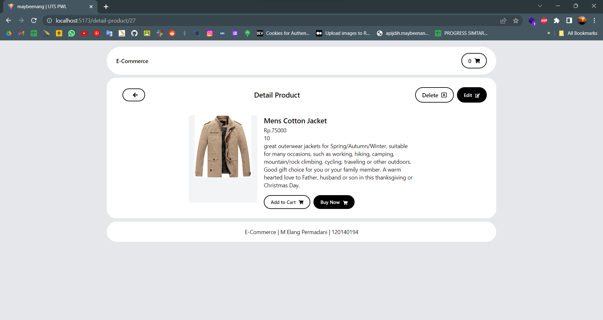

# UTS PWL Frontend

## Author

- 120140194 - Muhammad Elang Permadani

## Tech Stack

- React
- TypeScript
- Vite
- Tailwind CSS
- useSWR
- React Router DOM
- React Hook Form

## How to run

- Clone this repository

```bash
git clone https://github.com/maybeenang/PWL-UTS-FrontEnd.git
```

- change directory

```bash
cd PWL-UTS-FrontEnd
```

- Install dependencies

```bash
npm install
```

- Run the app

```bash
npm run dev
```

note: make sure the backend is running, you can check it [here](https://github.com/maybeenang/PWL-UTS-BackEnd.git)

## Screenshots

- Home Page


- Create Product Page


- Update Product Page


- Delete Product


- Detail Product Page



- Cart Page


- Checkout Page and Sum total price (from server)


